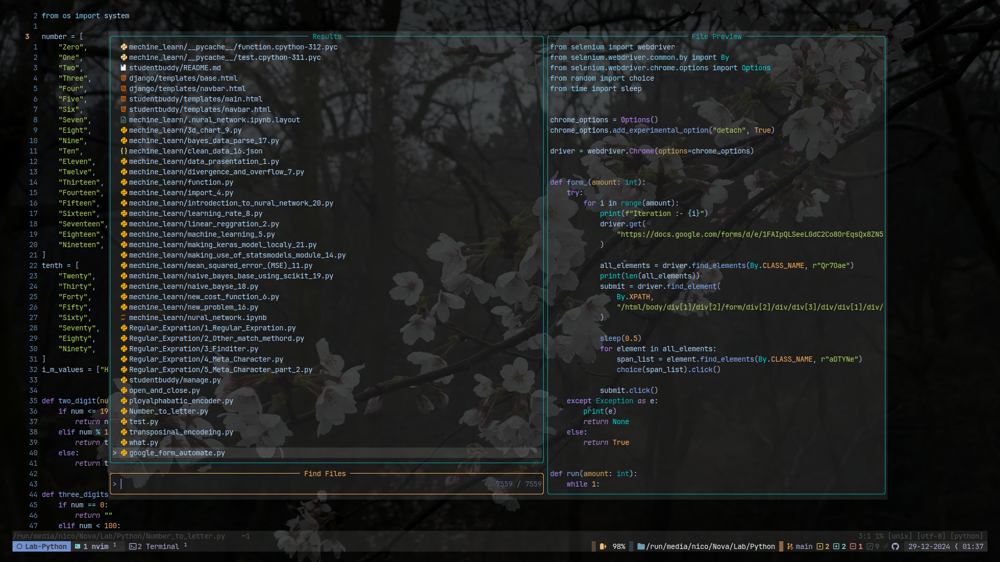

  


> This my nvim config,  
> Use if you want to, and  
> Just watch this videos before if you are a *`NOOB`*
- [x] [Vim as your Editor]( https://www.youtube.com/watch?v=X6AR2RMB5tE&list=PLm323Lc7iSW_wuxqmKx_xxNtJC_hJbQ7R )
- [x] [0 to LSP : Neovim RC From Scratch](https://www.youtube.com/watch?v=w7i4amO_zaE&t=844s)
- [x] [Revamp Neovim RC](https://www.youtube.com/watch?v=ZWWxwwUsPNw&list=PLA1PbPOIrviIW6R0dZbLjYyGsRMWH4B3d)
- [x] [Teaching Neovim From Scratch To A Noob](https://www.youtube.com/watch?v=-ybCiHPWKNA)

---

1. Start


2. Telescope



3. oil


4. Harpoon


5. Flash


6. LSP


7. Hex Editor


8. MarkDown Render


9. CSV Viewer


10. Trouble


11. Undo Tree


> This is how my config is structured

```
.
├── after
│   └── plugin
│       ├── colors.lua
│       └── remaps.lua
├── ftplugin
│   └── json.lua
├── init.lua
├── lua
    ├── config
    │   ├── autocommands.lua
    │   ├── keymaps.lua
    │   ├── lazy.lua
    │   └── options.lua
    └── plugins
        ├── comment.lua
        ├── csv_viewer.lua
        ├── dressing.lua
        ├── flash.lua
        ├── gitsigns.lua
        ├── harpoon.lua
        ├── hexeditor.lua
        ├── lsp.lua
        ├── lspsaga.lua
        ├── lsp_signature.lua
        ├── luasnip.lua
        ├── notify.lua
        ├── nvim_autopairs.lua
        ├── nvim_colorizer.lua
        ├── nvim_recorder.lua
        ├── nvim_treesitter_context.lua
        ├── nvim_treesitter.lua
        ├── nvim_treesitter_textobject.lua
        ├── oil.lua
        ├── render_markdown.lua
        ├── surround.lua
        ├── telescope.lua
        ├── theams.lua
        ├── trouble.lua
        ├── undotree.lua
        └── vim_be_good.lua
```

> Link for all the plugins github page, Plz check them out.

* [Comment](https://github.com/numToStr/Comment.nvim)  
* [CSV view](https://github.com/hat0uma/csvview.nvim)  
* [Dressing](https://github.com/stevearc/dressing.nvim)  
* [Flash](https://github.com/folke/flash.nvim)  
* [Gitsigns](https://github.com/lewis6991/gitsigns.nvim)  
* [Harpoon](https://github.com/ThePrimeagen/harpoon)  
* [Hex Editor](https://github.com/RaafatTurki/hex.nvim)  
* [For LSP config use the Video above or use the kickstart to learn](https://github.com/nvim-lua/kickstart.nvim)  
* [Lspsaga](https://github.com/nvimdev/lspsaga.nvim)  
* [LuaSnip](https://github.com/L3MON4D3/LuaSnip)  
* [Nvim-Notify](https://github.com/rcarriga/nvim-notify)  
* [Nvim-Autopairs](https://github.com/windwp/nvim-autopairs)  
* [Nvim-Colorizer](https://github.com/norcalli/nvim-colorizer.lua)  
* [Nvim-Recorder](https://github.com/chrisgrieser/nvim-recorder)  
* [Nvim-Treesitter](https://github.com/nvim-treesitter)  
* [Oil](https://github.com/stevearc/oil.nvim)  
* [Render-Markdown](https://github.com/MeanderingProgrammer/render-markdown.nvim)  
* [Nvim-Surround](https://github.com/kylechui/nvim-surround)  
* [Telescope](https://github.com/nvim-telescope/telescope.nvim)  
* [Tokyonight](https://github.com/folke/tokyonight.nvim)  
* [Trouble](https://github.com/folke/trouble.nvim)  
* [UndoTree](https://github.com/mbbill/undotree)  
* [Vim-Be-Good](https://github.com/ThePrimeagen/vim-be-good)  

***This is it,  
Hope you liked my config.***

***If you want to go deep in Nvim config [Nvim Docs](https://neovim.io/doc/).***
